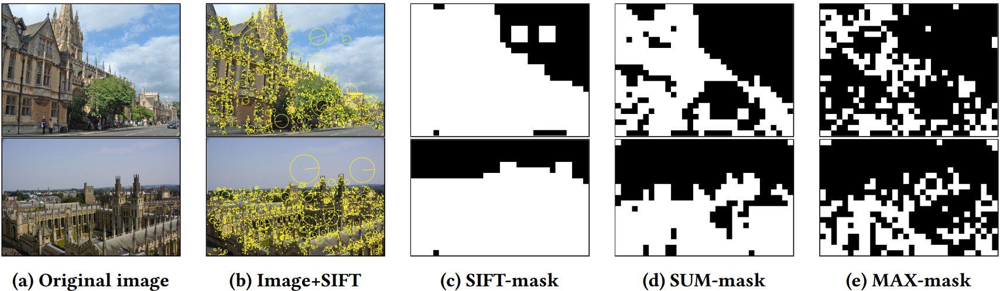

Selective Deep Convolutional Features for Image Retrieval
===========



This is the MATLAB implements of our methods accepted in [ACM MM 2017](http://www.acmmm.org/2017/). [[pdf]](https://arxiv.org/abs/1707.00809)

This code implements 
1. The framework of produce global image representation
* Pre-processing: PCA + l2-normalize
* Masking scheme: MAX-mask/SUM-mask
* Embedding: Triangular Embedding (Temb) [1] and Fast Function Approximation Embedding (F-FAemb) [2]
* Aggregating: Democractic pooling [1]
* Post-processing: rotation and whitening, Power-law normalization.
2. Extract conv. feature of images

[1] Hervé Jégou and Andrew Zisserman. Triangulation embedding and democratic aggregation for image search. In CVPR 2014.

[2] Thanh-Toan Do and Ngai-Man Cheung. Embedding based on function approximation for large scale image search. TPAMI (2017).

### BibTex
``` 
@INPROCEEDINGS{selectiveDeepConvFea,
 author    = {Tuan Hoang and Do, Thanh-Toan and Dang-Khoa Le Tan and Cheung, Ngai-Man},
 title     = {Selective Deep Convolutional Features for Image Retrieval},
 bookTitle = {ACM Multimedia},
 year      = {2017},
 month     = {Oct},
}
```


Prerequisites
=============
The code include:
- The Yael library (obtained from the website https://gforge.inria.fr/frs/?group_id=2151)
  A copy of this library is included in 'tools' folder.
- MatConvNet and VlFeat libraries, a script to automatically install these libraries is included in 'tools/'.

Usage
=============
1) Firstly, please execute the script 'utils/make.m' to compile to build the mex file for FA-emb and Triangular Embedding (Temb) methods.
2) Modify the parameters in 'option.m' file appropriately. Please see the parameter descriptions in 'option.m' file.
3) Run the following script
```
main
```

Otherwise, execute the pre-configured MATLAB scripts to execute and reproduce results of the corresponing experiments.

Files and subfolders
=====================
|Filename|Description|
|--------|----------|
|README                      | This file|
|main.m                      | The main script for running whole process.|
|opt.m                       | The script contains all parameter setting.|
|exp1_table3_framework_analysis.m       | The pre-configured MATLAB script to execute and reproduce the results of experiment of Table 3. |
|exp2_figure3_powerlaw_norm_analysis.m       | The pre-configured MATLAB script to execute and reproduce the results of experiment of Figure 3. |
|exp3_figure4_representation_dim_analysis.m       | The pre-configured MATLAB script to execute and reproduce the results of experiment of Figure 4. |
|exp4_table5_image_size_analysis.m       | The pre-configured MATLAB script to execute and reproduce the results of experiment of Table 5. |
|exp5_figure5_conv_layer_analysis.m       | The pre-configured MATLAB script to execute and reproduce the results of experiment of Figure 5. |
|exp6_table6_compare_SOTA_part1.m         | The pre-configured MATLAB script to execute and reproduce the results of experiment of Table 6 - Top section. |
|exp6_table6_compare_SOTA_part2.m         | The pre-configured MATLAB script to execute and reproduce the results of experiment of Table 6 - Bottom section. |
|||
|extract_feature_map/        |Contains files for extracting conv. features. See the README file inside this folder for more information.|
|tools/| |
|tools/download_compile_packages.m | The MATLAB script to download and compile MatConvnet and VlFeat libraries. |
|utils/| |
|utils/make.m                | The MATLAB script to build the mex file for FA-emb and Triangular Embedding (Temb) methods.|
|utils/democratic/           |contains MATLAB script files for democratic pooling methods.|
|utils/faemb/                |contains MATLAB script files for F-FAemb method.|
|utils/faemb_mex/            |contains mex files for F-FAemb method.|
|utils/triemb/               |contains MATLAB script, mex files for Triangular Embedding method.|
|utils/vlad/                 |contains MATLAB script files for VLAD method.|
|utils/evaluation/           |contains MATLAB script files for evaluation.|
|utils/yael/                 |contains the yael library|
|utils/plot_charts/			 |contains the MATLAB scripts to plot figures or print out tables. |
|utils/embedding.m           |Process embedding and aggregating|
|utils/apply_mask.m          |Compute and then apply mask on the conv. features.|
|utils/crop_qim.m            |Crop query images.|
|utils/learn_rn.m            |Learn projection (PCA/whitening) matrix|
|utils/vecpostproc.m         |Apply post-processing|
|data/                       |contains ground truth and data. In case you may want to retrain, please download the provided data and put them in this folder|
|data/workdir/               |contains output files (i.e., parameters, embedded features)|

